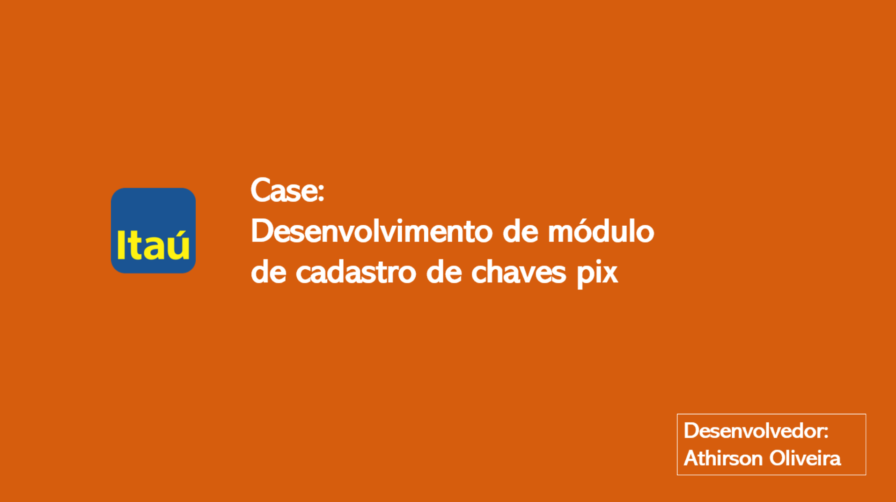
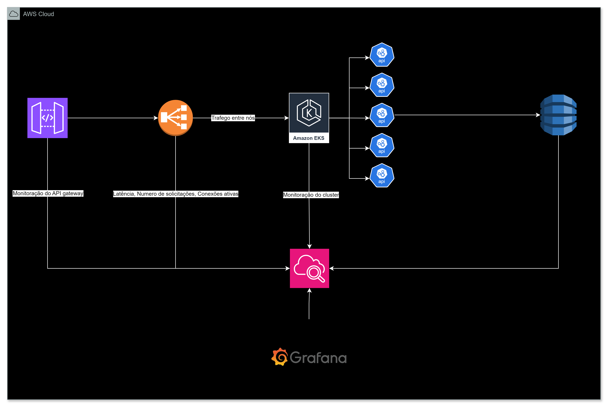
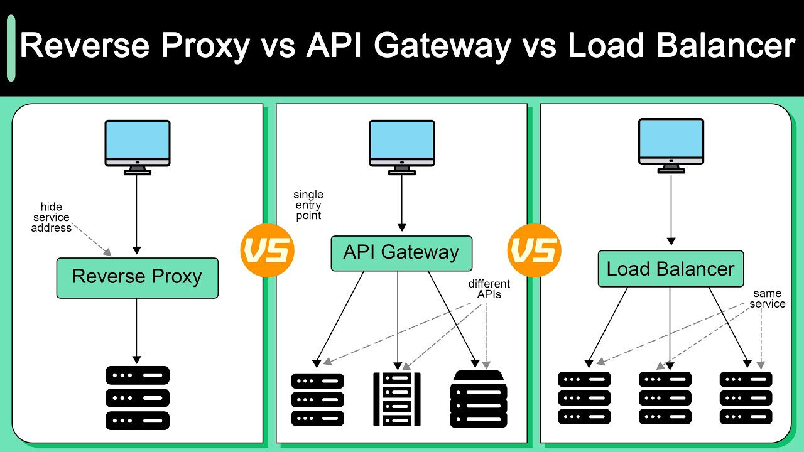
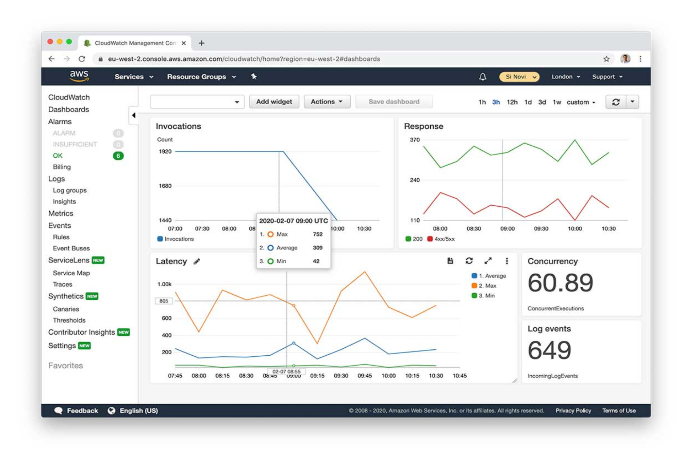
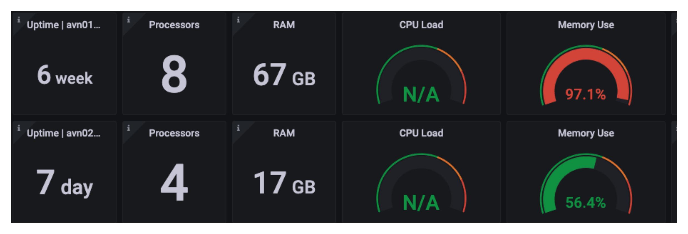
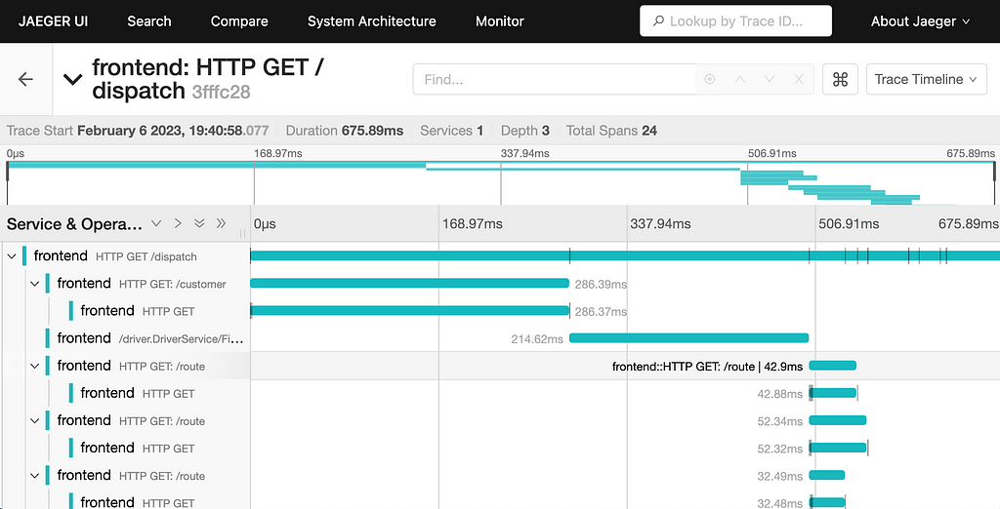
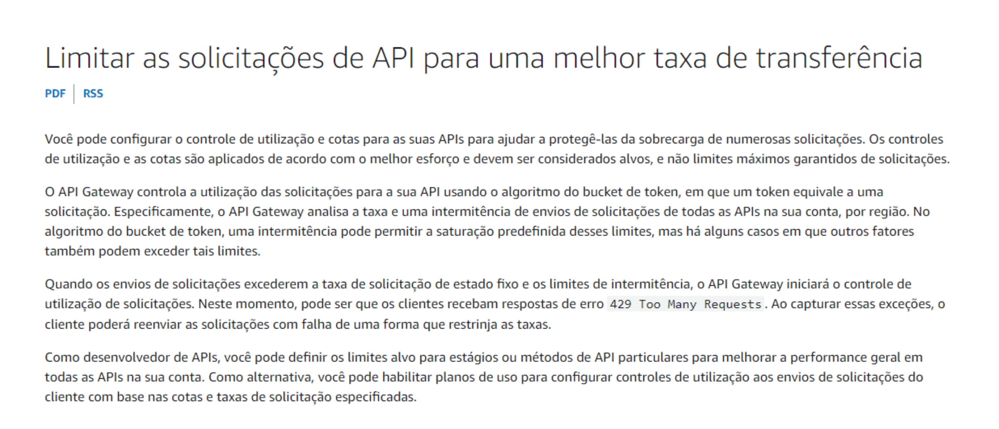

# Sistema de Cadastro de Chaves PIX



[](https://openjdk.java.net/projects/jdk/17/)
[](https://spring.io/projects/spring-boot)
[](https://www.mongodb.com/)
[](https://maven.apache.org/)

## Versão 2.0.0 - Hexagonal Architecture Refactor

### 🏗️ Arquitetura

O sistema foi completamente refatorado para implementar **Arquitetura Hexagonal (Ports & Adapters)**, proporcionando:

- **Separação clara de responsabilidades**
- **Alta testabilidade**
- **Baixo acoplamento**
- **Flexibilidade para mudanças de tecnologia**

#### Estrutura do Projeto

```
src/
├── main/java/io/github/athirson010/cadastro_chaves_pix/
│   ├── domain/                           # Camada de Domínio (Core)
│   │   ├── entities/                     # Entidades de Negócio
│   │   │   ├── ChavePix.java
│   │   │   └── Conta.java
│   │   ├── valueobjects/                 # Objetos de Valor
│   │   │   ├── ChavePixId.java
│   │   │   ├── ContaId.java
│   │   │   ├── ChavePixValue.java
│   │   │   ├── NumeroAgencia.java
│   │   │   └── NumeroConta.java
│   │   ├── enums/                        # Enumerações
│   │   │   ├── StatusChaveEnum.java
│   │   │   ├── TipoChaveEnum.java
│   │   │   ├── TipoContaEnum.java
│   │   │   └── TipoPessoaEnum.java
│   │   ├── exceptions/                   # Exceções de Domínio
│   │   │   ├── ChaveDuplicadaException.java
│   │   │   ├── ChavePixNaoEncontradaException.java
│   │   │   └── LimiteChavesExcedidoException.java
│   │   └── services/                     # Serviços de Domínio
│   │       ├── validation/
│   │       │   ├── ChavePixValidationStrategy.java
│   │       │   ├── ChavePixValidationService.java
│   │       │   └── strategies/
│   │       └── factory/
│   │           └── ChavePixValidationFactory.java
│   ├── application/                      # Camada de Aplicação
│   │   ├── ports/
│   │   │   ├── input/                    # Portas de Entrada (Use Cases)
│   │   │   │   ├── CadastrarChavePixUseCase.java
│   │   │   │   ├── AtualizarChavePixUseCase.java
│   │   │   │   ├── InativarChavePixUseCase.java
│   │   │   │   ├── BuscarChavesPixUseCase.java
│   │   │   │   └── CadastrarContaUseCase.java
│   │   │   └── output/                   # Portas de Saída
│   │   │       ├── ChavePixRepositoryPort.java
│   │   │       └── ContaRepositoryPort.java
│   │   ├── services/                     # Implementação dos Use Cases
│   │   │   ├── CadastrarChavePixService.java
│   │   │   ├── AtualizarChavePixService.java
│   │   │   ├── InativarChavePixService.java
│   │   │   ├── BuscarChavesPixService.java
│   │   │   └── CadastrarContaService.java
│   │   └── dto/                          # Data Transfer Objects
│   │       ├── CadastrarChavePixCommand.java
│   │       ├── AtualizarChavePixCommand.java
│   │       ├── CadastrarContaCommand.java
│   │       └── FiltroChavePixQuery.java
│   └── infrastructure/                   # Camada de Infraestrutura
│       ├── adapters/
│       │   ├── input/                    # Adaptadores de Entrada
│       │   │   └── web/
│       │   │       ├── controllers/
│       │   │       ├── dto/
│       │   │       ├── mappers/
│       │   │       └── exception/
│       │   └── output/                   # Adaptadores de Saída
│       │       └── persistence/
│       │           └── mongodb/
│       │               ├── entities/
│       │               ├── repositories/
│       │               ├── adapters/
│       │               └── mappers/
│       └── configuration/                # Configurações
│           ├── UseCaseConfiguration.java
│           └── ValidationConfiguration.java
```

### 🎯 Design Patterns Implementados

#### 1. **Hexagonal Architecture (Ports & Adapters)**
- **Domínio isolado** da infraestrutura
- **Portas** definem contratos
- **Adaptadores** implementam detalhes técnicos

#### 2. **Strategy Pattern**
- Validação de chaves PIX por tipo
- Implementações específicas para CPF, CNPJ, Email, Celular e Aleatória

#### 3. **Factory Pattern**
- `ChavePixValidationFactory` para criação de serviços de validação
- Centralização da criação de objetos complexos

#### 4. **Repository Pattern**
- Abstração da camada de persistência
- Facilita testes e mudanças de tecnologia

#### 5. **Command Pattern**
- DTOs representam comandos de operações
- Encapsulamento de parâmetros de operações

#### 6. **Value Object Pattern**
- Objetos imutáveis com validação integrada
- `ChavePixValue`, `NumeroAgencia`, `NumeroConta`, etc.

#### 7. **Domain Events** (Estrutura preparada)
- Base para eventos de domínio futuros
- Comunicação entre bounded contexts

### 📋 Funcionalidades

#### Gestão de Chaves PIX
- ✅ **Cadastro** de novas chaves PIX
- ✅ **Atualização** de dados da conta
- ✅ **Inativação** de chaves
- ✅ **Consulta** com filtros avançados
- ✅ **Validação** por tipo de chave

#### Tipos de Chave Suportados
- 📧 **Email**: Validação de formato
- 📱 **Celular**: Formato internacional (+5511999999999)
- 🆔 **CPF**: Validação com dígitos verificadores
- 🏢 **CNPJ**: Validação com dígitos verificadores
- 🎲 **Aleatória**: UUID formato (xxxxxxxx-xxxx-xxxx-xxxx-xxxxxxxxxxxx)

#### Regras de Negócio
- **Pessoa Física**: Máximo 5 chaves PIX
- **Pessoa Jurídica**: Máximo 20 chaves PIX
- **Unicidade**: Cada chave PIX deve ser única no sistema
- **Validação**: Formato específico por tipo de chave

### 🔧 Tecnologias

#### Core
- **Java 17**: Linguagem de programação
- **Spring Boot 3.2.5**: Framework principal
- **Spring Data MongoDB**: Persistência
- **Spring Validation**: Validação de entrada

#### Qualidade
- **JUnit 5**: Testes unitários
- **Mockito**: Mocks para testes
- **Jacoco**: Cobertura de testes
- **SonarQube**: Qualidade de código

#### Documentação
- **SpringDoc OpenAPI**: Documentação da API
- **Swagger UI**: Interface para testes

### 🚀 Como Executar

#### Pré-requisitos
- Java 17+
- Maven 3.8+
- MongoDB 4.4+
- Docker (opcional)

#### Executando com Maven
```bash
# Instalar dependências
mvn clean install

# Executar aplicação
mvn spring-boot:run

# Executar testes
mvn test

# Gerar relatório de cobertura
mvn jacoco:report
```

#### Executando com Docker
```bash
# Subir MongoDB
docker-compose up -d

# Build da aplicação
docker build -t cadastro-chaves-pix .

# Executar aplicação
docker run -p 8080:8080 cadastro-chaves-pix
```

### 📖 API Endpoints

#### Chaves PIX
- `POST /api/v1/chaves-pix` - Cadastrar nova chave
- `PUT /api/v1/chaves-pix/{id}` - Atualizar chave
- `DELETE /api/v1/chaves-pix/{id}` - Inativar chave
- `GET /api/v1/chaves-pix/{id}` - Buscar por ID
- `GET /api/v1/chaves-pix` - Listar com filtros

#### Documentação
- **Swagger UI**: http://localhost:8080/swagger-ui.html
- **OpenAPI Spec**: http://localhost:8080/v3/api-docs

### 🧪 Testes

#### Estratégia de Testes
- **Testes Unitários**: Domínio e Aplicação
- **Testes de Integração**: Adapters
- **Testes de Contrato**: APIs

#### Executar Testes
```bash
# Todos os testes
mvn test

# Testes específicos
mvn test -Dtest=ChavePixTest

# Com cobertura
mvn test jacoco:report
```

### 📊 Monitoramento e Observabilidade

#### Métricas
- **Actuator**: Endpoints de saúde
- **Micrometer**: Métricas customizadas
- **Prometheus**: Coleta de métricas

#### Logs
- **Logback**: Configuração de logs
- **JSON Format**: Logs estruturados
- **Correlation ID**: Rastreabilidade

### 🔄 Changelog

#### v2.0.0 (2024-XX-XX)
- ✨ **BREAKING**: Refatoração completa para Arquitetura Hexagonal
- ✨ **NEW**: Implementação de Design Patterns (Strategy, Factory, Repository)
- ✨ **NEW**: Value Objects com validação integrada
- ✨ **NEW**: Separação clara entre domínio e infraestrutura
- ✨ **NEW**: Testes unitários abrangentes
- ✨ **NEW**: Global Exception Handler
- ✨ **NEW**: Validação robusta por tipo de chave
- 🐛 **FIX**: Validação de CPF e CNPJ com algoritmo correto
- 📝 **DOCS**: Documentação completa da arquitetura

#### v1.x.x
- Sistema com arquitetura em camadas tradicional
- Funcionalidades básicas de CRUD

### 🤝 Contribuição

1. Fork o projeto
2. Crie uma branch para sua feature (`git checkout -b feature/nova-feature`)
3. Commit suas mudanças (`git commit -am 'Adiciona nova feature'`)
4. Push para a branch (`git push origin feature/nova-feature`)
5. Abra um Pull Request

### 📄 Licença

Este projeto está sob a licença MIT. Veja o arquivo [LICENSE](LICENSE) para mais detalhes.

---

## Desenho de Arquitetura Original

### HPA (Horizontal pod autoscaling)


<div align="center">



</div>

# Perguntas do case:

## Questão 1

* Tempo de resposta dos endpoints POST /pagamento e / GET /pagamentos - P50 / P99
* Quantidade de threads simultâneas (min/avg/max) por período.
* Tempo total para aprovação de uma chave min/avg/max) por período (entre envio até resposta do contacorrente)
* Taxa de scalling-in / scalling-out dos serviços.
* Saúde da aplicação (cpu/memoria etc) e recursos de infraestrutura envolvidos (SQS/Dynamo etc)
* Quantidade de erros SaldoInsuficienteException retornado pelo "conta-corrente" por período.
* Quando reportado a exceção ContaSuspensaPorFraudeException pelo "conta-corrente" deve ser enviado
  um alarme seja por email/teams/slack. para o time "análise de fraudes".
* Quando mais de 10 pagamentos num prazo de 1 hora forem negados por "excedeu o tempo" o time deve
  ser notificado seja por email/teams/slack.

### CloudWatch:

    Contém todas as monitorias necessarias do item 1.



### Grafana:

    Monitoria as Métricas em geral alimentado pelo Cloudwatch
    Saúde da aplicação (cpu/memoria etc) e recursos de infraestrutura envolvidos (SQS/Dynamo etc)



### Jaegger:

    Monitoria de traces por intervalos de tempo.
    Ele monta uma cascata de chamadas com todos os detalhes de tempo, mostrando um possivel ofensor na comunicação 
    entre serviços.



## Questão 2

O Serviço suporta no máximo 10000 solicitações simultâneas. Ambos os endpoints devem disponibilizar
taxas de aceitação semelhantes.


Fonte: https://docs.aws.amazon.com/pt_br/apigateway/latest/developerguide/api-gateway-request-throttling.html

    Além de otimizar a minha aplicação para executar o máximo de requisições, aplicaria dentro de uma infraestrutura k8s utilizando uma configuração de HPA (Horizontal Pod Autoscaling) para subir os pods sobre demanda.
    Orquestrar um teste de estresse com 10000 requisições simultâneas, analisando a quantidade de pods replicados e deixar como média.

O Pagamento pode ser processado dentro de 30 minutos. Garantir que o "conta-corrente" receberá a
mensagem dentro do período. Caso o prazo seja ultrapassado, deverá ser finalizado como "excedeu prazo"

    Utilizaria um serviço para enviar o pagamento de forma assíncrona para uma mensageria e consultaria seu status periodicamente. Para a comunicação, utilizaria uma integração com o SNS.

Durante o envio de um pagamento, caso o conta-cliente ou o serviço do BACEN apresente erro 5xx deverá
ser realizada até 3 tentativas de envio.

    Conforme a solução anterior, o evento de mensagem estaria em um serviço de mensageria junto com a quantidade de tentativas. Assim, o serviço pode fazer o gerenciamento.

Caso o serviço "conta-cliente" e o "serviço-bacen" apresente sucessivamente erros 5xx deverá ser reduzida
a entrada de novas solicitações de pagamentos até que o serviço apresenta melhoria na taxa de resposta.

    Monitorando com o CloudWatch e definindo as métricas, integra-se com o AWS WAF para bloquear o tráfego (circuit breaker)

A suspensão de uma conta por suspeita de fraude é válida por 1 hora. O serviço "conta-cliente" possui
taxa e resposta de 2s. Reduza a dependência com este serviço se possível.

    Em caso de suspensão de conta, podemos alimentar um cache com uma chave única (CPF/CNPJ/Número da conta + Agência). Antes de solicitar o serviço de conta, ele faz essa validação, eliminando assim essa dependência.

## Questão 3

* Durante um deploy em produção, deverá ser garantida a aplicação da estratégia de blue-green no serviço
  "pix-inicia-pagamento-service". Indique o que deverá ser garantido no recurso e previamente testado.

      blue-green são dois serviços com o mesmo ambiente, e se o serviço novo aumentar a taxa de erro ele não realiza o deploy completo e efetua o rollback.
      Já utilizei algo parecido "Cannary" onde uma quantidade especifica de usuários utilizam uma nova url com as novas features

* Pagamentos com mais de 6 meses deverão ser removidos da base de dados do serviço "pix-iniciapagamento-service".

      Um scheduler, executado a cada 30 dias, realizaria uma query que limparia os dados anteriores à data de hoje menos 6 meses, removendo tudo antes dessa data gerada.

* O período de suspensão de uma conta e tempo máximo de envio de um pagamento para processamento
  são valores bem definidos, mas que podem ser alterados em caso de incidente. Garanta que sejam fáceis de serem
  alterados,
  porém devidamente governados/auditados.

      Utilizar Variáveis de ambientes em um security manager.