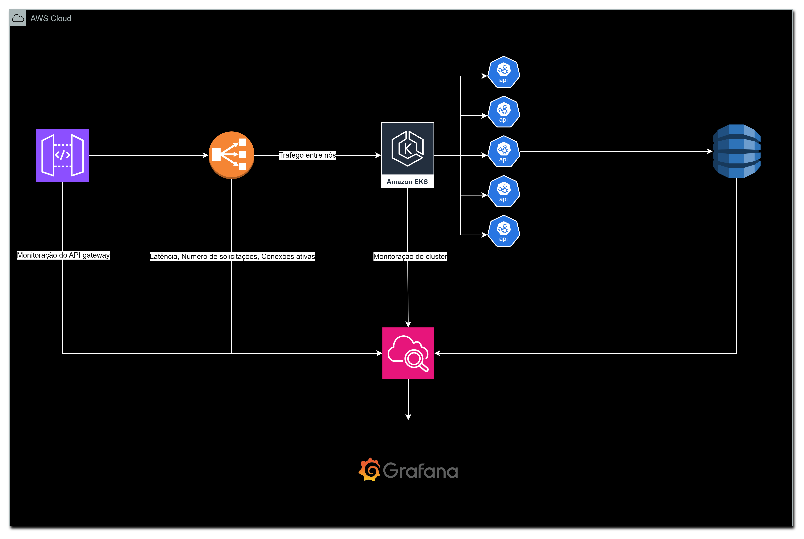

# Desenho de Arquitetura

### HPA (Horizontal pod autoscaling)

# Perguntas do case:

## Questão 1

* Tempo de resposta dos endpoints POST /pagamento e / GET /pagamentos - P50 / P99
* Quantidade de threads simultâneas (min/avg/max) por período.
* Tempo total para aprovação de uma chave min/avg/max) por período (entre envio até resposta do contacorrente)
* Taxa de scalling-in / scalling-out dos serviços.
* Saúde da aplicação (cpu/memoria etc) e recursos de infraestrutura envolvidos (SQS/Dynamo etc)
* Quantidade de erros SaldoInsuficienteException retornado pelo "conta-corrente" por período.
* Quando reportado a exceção ContaSuspensaPorFraudeException pelo "conta-corrente" deve ser enviado
  um alarme seja por email/teams/slack. para o time "análise de fraudes".
* Quando mais de 10 pagamentos num prazo de 1 hora forem negados por "excedeu o tempo" o time deve
  ser notificado seja por email/teams/slack.

### CloudWatch:

    Contém todas as monitorias necessarias do item 1.

### Grafana:

    Monitoria as Métricas em geral alimentado pelo Cloudwatch
    Saúde da aplicação (cpu/memoria etc) e recursos de infraestrutura envolvidos (SQS/Dynamo etc)

### Jaegger:

    Monitoria de traces por intervalos de tempo.
    Ele monta uma cascata de chamadas com todos os detalhes de tempo, mostrando um possivel ofensor na comunicação 
    entre serviços.

## Questão 2

O Serviço suporta no máximo 10000 solicitações simultâneas. Ambos os endpoints devem disponibilizar
taxas de aceitação semelhantes.

Fonte: https://docs.aws.amazon.com/pt_br/apigateway/latest/developerguide/api-gateway-request-throttling.html

    Além de otimizar a minha aplicação para executar o máximo de requisições, aplicaria dentro de uma infraestrutura k8s utilizando uma configuração de HPA (Horizontal Pod Autoscaling) para subir os pods sobre demanda.
    Orquestrar um teste de estresse com 10000 requisições simultâneas, analisando a quantidade de pods replicados e deixar como média.

O Pagamento pode ser processado dentro de 30 minutos. Garantir que o "conta-corrente" receberá a
mensagem dentro do período. Caso o prazo seja ultrapassado, deverá ser finalizado como "excedeu prazo"

    Utilizaria um serviço para enviar o pagamento de forma assíncrona para uma mensageria e consultaria seu status periodicamente. Para a comunicação, utilizaria uma integração com o SNS.

Durante o envio de um pagamento, caso o conta-cliente ou o serviço do BACEN apresente erro 5xx deverá
ser realizada até 3 tentativas de envio.

    Conforme a solução anterior, o evento de mensagem estaria em um serviço de mensageria junto com a quantidade de tentativas. Assim, o serviço pode fazer o gerenciamento.

Caso o serviço "conta-cliente" e o "serviço-bacen" apresente sucessivamente erros 5xx deverá ser reduzida
a entrada de novas solicitações de pagamentos até que o serviço apresenta melhoria na taxa de resposta.

    Monitorando com o CloudWatch e definindo as métricas, integra-se com o AWS WAF para bloquear o tráfego (circuit breaker)

A suspensão de uma conta por suspeita de fraude é válida por 1 hora. O serviço "conta-cliente" possui
taxa e resposta de 2s. Reduza a dependência com este serviço se possível.

    Em caso de suspensão de conta, podemos alimentar um cache com uma chave única (CPF/CNPJ/Número da conta + Agência). Antes de solicitar o serviço de conta, ele faz essa validação, eliminando assim essa dependência.

## Questão 3

* Durante um deploy em produção, deverá ser garantida a aplicação da estratégia de blue-green no serviço
  "pix-inicia-pagamento-service". Indique o que deverá ser garantido no recurso e previamente testado.

      blue-green são dois serviços com o mesmo ambiente, e se o serviço novo aumentar a taxa de erro ele não realiza o deploy completo e efetua o rollback.
      Já utilizei algo parecido "Cannary" onde uma quantidade especifica de usuários utilizam uma nova url com as novas features

* Pagamentos com mais de 6 meses deverão ser removidos da base de dados do serviço "pix-iniciapagamento-service".

      Um scheduler, executado a cada 30 dias, realizaria uma query que limparia os dados anteriores à data de hoje menos 6 meses, removendo tudo antes dessa data gerada.

* O período de suspensão de uma conta e tempo máximo de envio de um pagamento para processamento
  são valores bem definidos, mas que podem ser alterados em caso de incidente. Garanta que sejam fáceis de serem
  alterados,
  porém devidamente governados/auditados.

      Utilizar Variáveis de ambientes em um security manager.